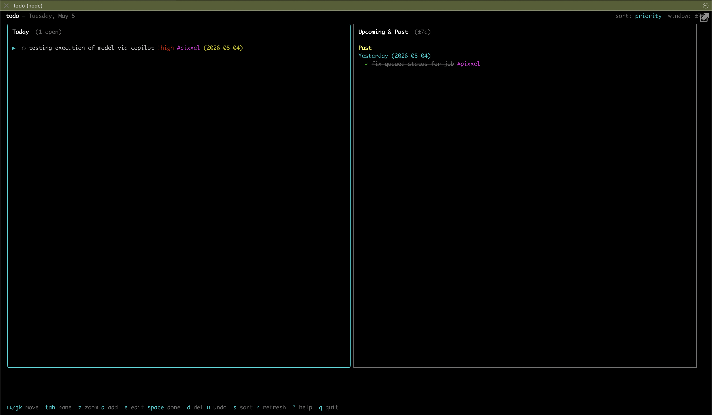
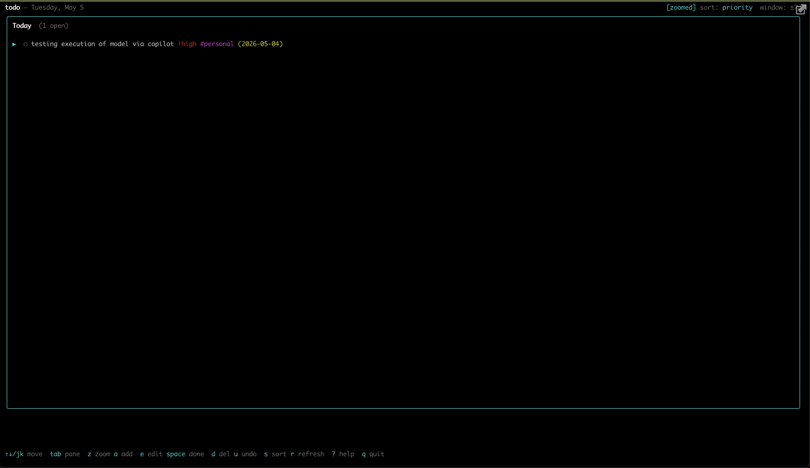
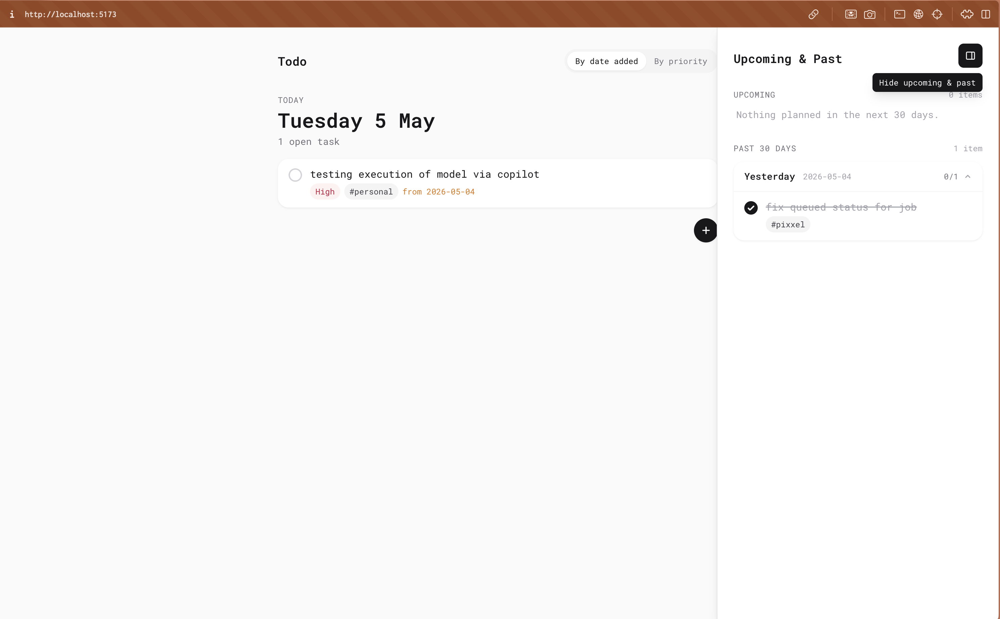

# Todo

A small, local-first todo app with a CLI for input and a clean React web UI for viewing.
Designed to be deployable as a PWA later.

## Install

Requires Node 20+.

```sh
npm install
npm run build
```

This builds `@todo/core`, `@todo/server`, `@todo/cli`. The web UI is built with
`npm run build -w @todo/web`.

## Initialize storage

```sh
node packages/cli/bin/todo init
```

This creates:
- `~/.todo/config.json`           — storage config
- `~/.todo/YYYY-MM.jsonl`         — current month's todo file

Customize:
```sh
node packages/cli/bin/todo init --data-dir /path/to/dir --port 4567
```

You can symlink the binary if you want a global `todo`:
```sh
ln -s "$(pwd)/packages/cli/bin/todo" /usr/local/bin/todo
```

## CLI

```sh
todo add "buy milk" --tags grocery --priority high
todo add "call dentist" --date 2026-05-03
todo list                       # 7 days back, today, 7 days ahead
todo list --date today
todo list --date 2026-05-03
todo list --date all
todo list --tags grocery
todo list --sort priority
todo done <id>                  # mark done
todo done <id> --undo           # mark not done
todo update <id> --content "buy oat milk" --priority medium
todo update <id> --date 2026-05-04
todo update <id> --priority none
todo delete <id>
todo serve                      # start API on http://127.0.0.1:4567
todo tui                        # open the interactive terminal UI
```

Running `todo` with no arguments opens the TUI.

## TUI



`todo tui` (or just `todo`) launches an Ink-based terminal UI:

- Today on the left, Upcoming + Past on the right.
- Keys: `↑↓ j k` move, `tab` switch panes, `z` zoom focused pane to fullscreen,
  `a` add, `e` edit content, `E` edit full (date / tags / priority),
  `space`/`x` toggle done, `d` delete (then `u` to undo within 5s),
  `s` cycle sort, `+`/`-` expand/shrink window, `r` reload, `?` help, `q` quit.
- The add bar accepts the same inline tokens as the web UI: `#tag`, `!high`, `^tomorrow`.

Press `z` to zoom the focused pane to fullscreen — useful when you want to see
just Today, or just Upcoming/Past, with more vertical room. `tab` un-zooms and
switches focus, so a single keystroke flips between sides.



## Web UI



In one terminal:
```sh
node packages/cli/bin/todo serve
```

In another:
```sh
npm run dev:web
```

Open <http://localhost:5173>. The Vite dev server proxies `/api/*` to the backend.

The UI shows:
- **Today** as the centered main column — large and focused.
- **Upcoming & Past** in a collapsible side panel; toggle from the top-right
  button. Open by default; preference is persisted in localStorage.
- A round `+` button below the list expands into the add bar with a syntax hint.
- Completed todos sink to the bottom of each day.
- Overdue incomplete todos are rolled forward to today and tagged with their original date.
- Click a todo to edit; trash icon to delete with a 5s undo toast.

The add bar parses inline tokens:
- `#tag` → tag
- `!high` / `!med` / `!low` → priority
- `^tomorrow` / `^2026-05-10` → date

## File format

JSONL, one todo per line, one file per month at `~/.todo/YYYY-MM.jsonl`:

```json
{"id":"260501-a3f","content":"buy milk","date":"2026-05-01","tags":["grocery"],"priority":"high","done":false,"createdAt":"...","updatedAt":"...","order":0}
```

The CLI and the server share the same storage module, so edits from either surface are
visible in both immediately (UI revalidates on focus).

## Architecture

```
packages/
  core/    — types, storage (JSONL), roll-forward, operations
  cli/     — commander wiring; talks to core directly
  server/  — Express HTTP API; talks to core directly
  web/     — Vite + React + Tailwind UI; talks to server over /api
```

## Roadmap (future)

- Tag filter UI (data path is already in)
- Drag-reorder within a date (`order` field reserved)
- TUI surface
- Deploy backend + serve PWA shell from the same origin
